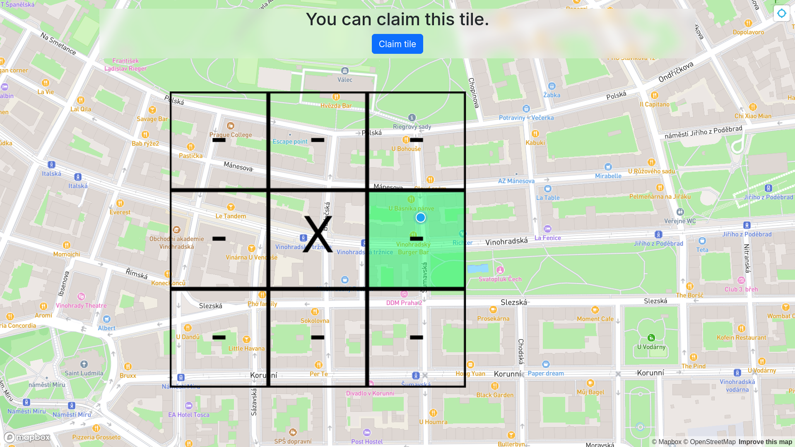
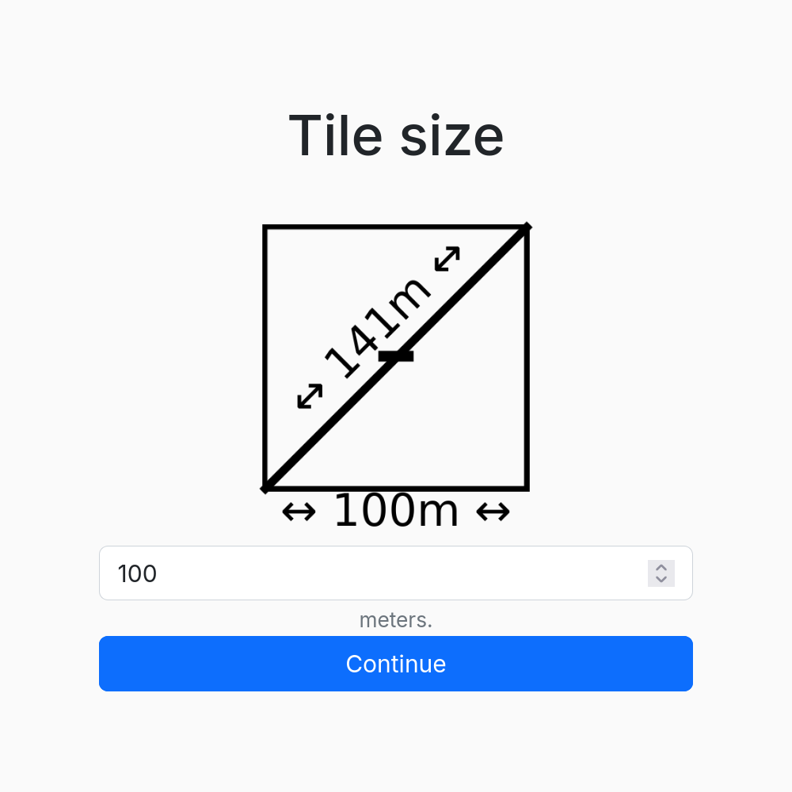
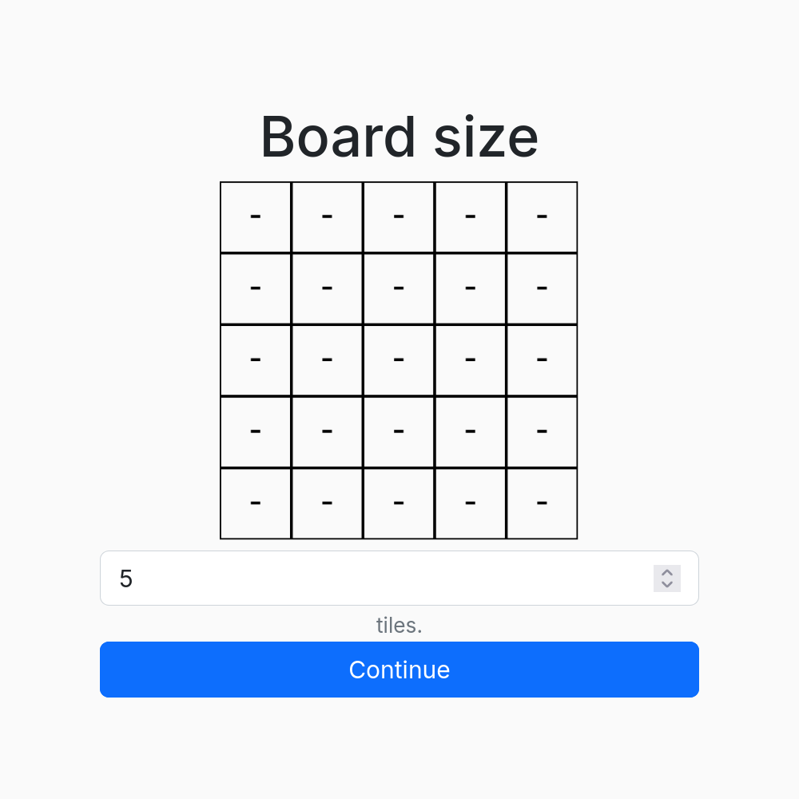

<h1 align="center">TicTacGo</h1>

Play [tic-tac-toe](https://en.wikipedia.org/wiki/Tic-tac-toe) (noughts and crosses) in the real world! An unlimited number of players, split into two teams (Xs and Os), compete by physically navigating a map to claim tiles. There's no turn system, turning it into a strategic race!



## Configuration

Modify the game settings to suit your preferences. Apart from modifying the game board's location, you can configure the size of each tile (in meters) and the number of tiles per the entire game board. You can also set the required number of tiles to connect to win.

<p align="center">
    
    
</p>

## Server setup

1. Clone the repository

2. Install the required Node packages by running `npm install` in the directory

3. Build the front-end script bundle by running `npm run build`

4. Install the required Python packages from `requirements.txt` using `pip install -r requirements.txt`

5. Provide an SSL certificate in the form of `cert.pem` and `key.pem` files. Here's a quick way to generate a self-signed certificate (run this in the server directory):
   
   ```bash
   openssl req -x509 -newkey rsa:4096 -keyout key.pem -out cert.pem -sha256 -days 3650 -nodes -subj "/C=XX/ST=StateName/L=CityName/O=CompanyName/OU=CompanySectionName/CN=CommonNameOrHostname"
   ```

6. Set your Mapbox access token in `config.json` (get one from https://account.mapbox.com/access-tokens/)

7. Run the Flask web server by running `python3 main.py`

8. You should now be able to open the provided address in a web browser. Enjoy!